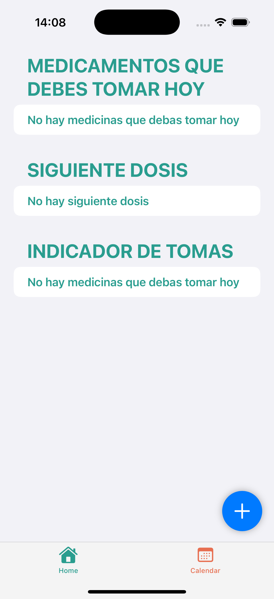
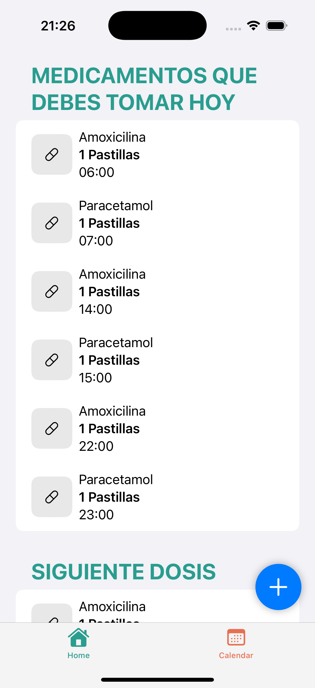
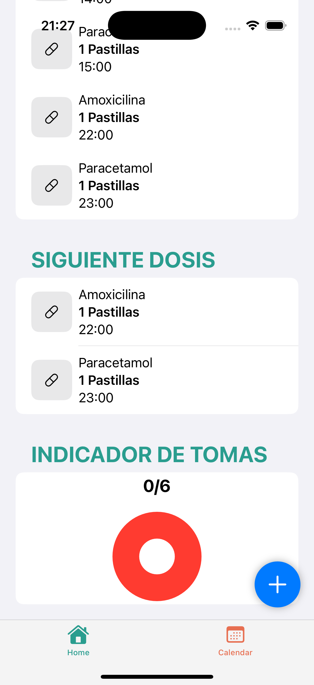
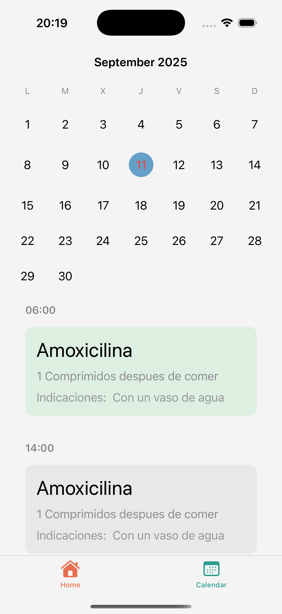
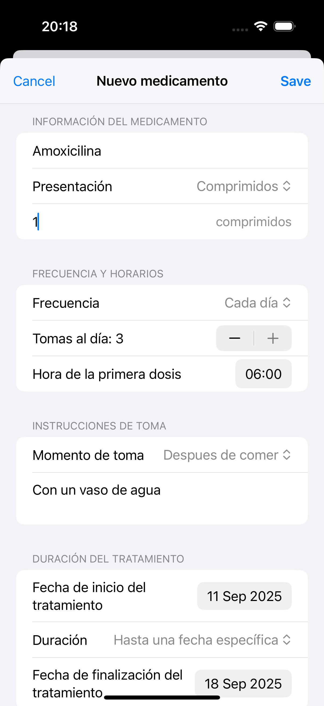

# PillMate

Aplicación iOS desarrollada con Swift y SwiftUI para la visualización de tratamientos de cualquier medicación.
Permite registrar medicamentos, consultar las tomas del día, marcar las tomas como realizadas, ver las próximas dósis, comprobar en un indicador si falta alguna por tomar, recibir recordatorios y consultar el historial en un calendario.

Este proyecto lo he creado con la finalidad de demostrar mis conocimientos en el desarrollo de aplicaciones iOS, aplicando buenas prácticas para un código limpio y escalable.

## 🚀 Características técnicas

- Interfaz construida 100% con **SwiftUI**
- Notificaciones locales con **UserNotifications**
- Almacenamiento local con **SwifData**
- Siguiendo los principios **SOLID** para mantener un código limpio, mantenible y escalable
- Arquitectura **MVVM**
- Navegación fluida e intuitiva
- Desarrollo para iOS 18+

## 📱 Fucionalidades principales

- **Home:** Muestra medicamentos del día, próximas dosís y un indicador de tomas.
- **Calendar:** Navegeación entre meses para ver los medicamentos del día seleccionado.
- **Formulario:** Registro de medicamentos.
- **Notificaciones:** Recordatorios automáticos a la hora que este programada la medicación.

## 📸 Screenshots
### Home

- Sin medicamentos

  

- Lista de medicamentos y próximas dosis 

    <table>
    <tr>
    <td></td>
    <td></td>
    </tr>
    </table>

- Indicador de tomas y medicación marcada como tomada

  

### 📅 Calendario

- Vista general del calendario

  

### ➕ Formulario

  

## 🛠️ Stack 

- **Lenguaje:** Swift 6
- **Frameworks:** SwiftUI, SwiftData, UserNotifications 
- **Arquitectura**: MVVM
- **Editor:** Xcode 16.3

## 👨‍💻 Sobre mí

Me llamo Andrés y soy desarrollador iOS en búsqueda de nuevas oportunidades profesionales. Con este proyecto mi intención es reflejar mi manera de trabajar con los conocimientos que tengo.

👉 Puedes contactarme en [Linkedin](https://www.linkedin.com/in/andres-aleu/) o por correo: **andresaleunz@gmail.com**
